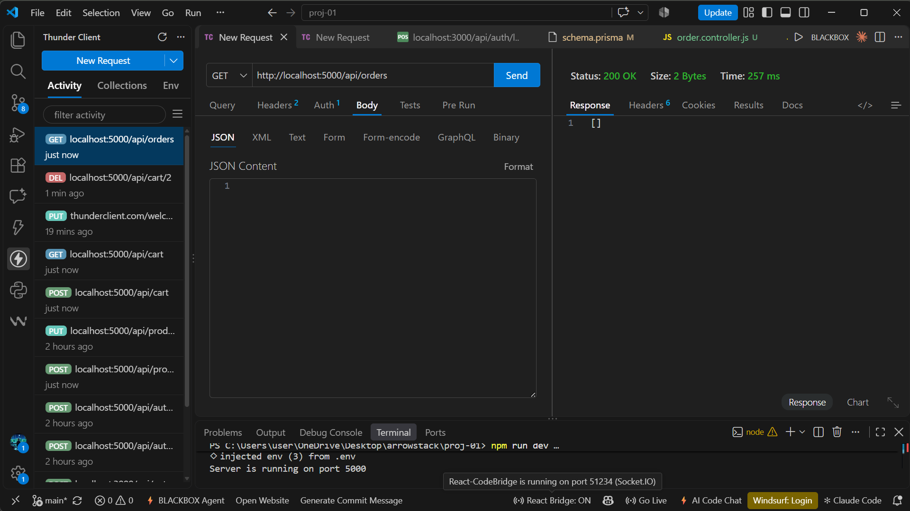
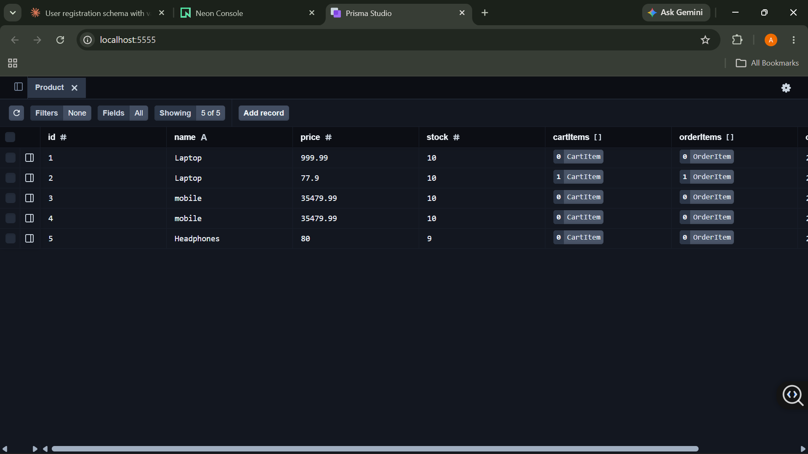
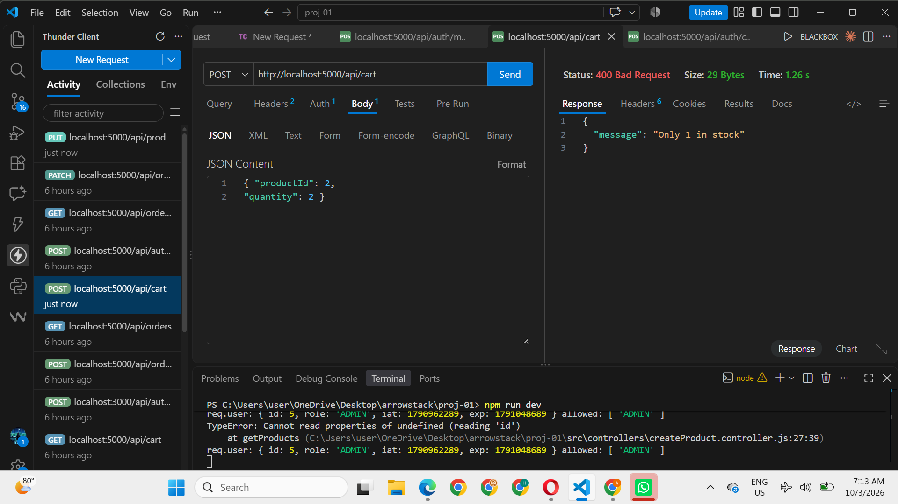
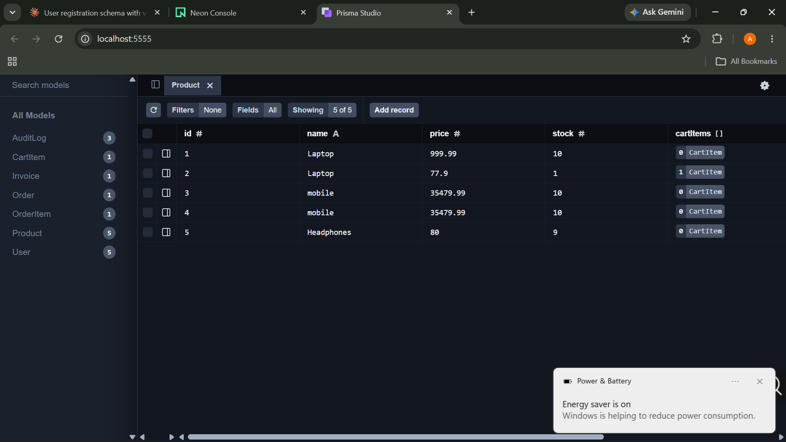
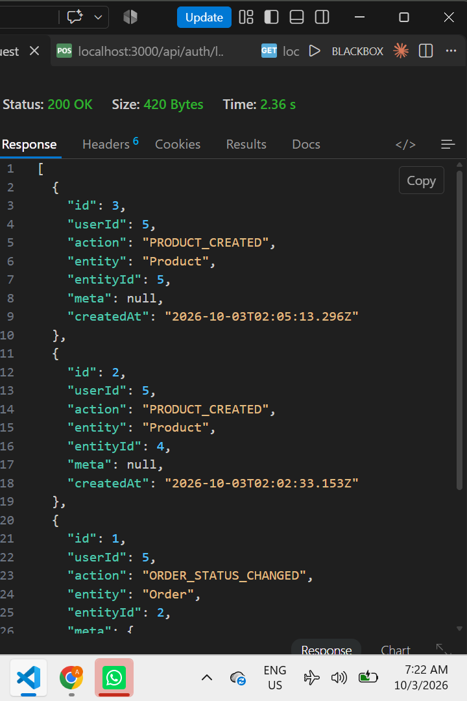
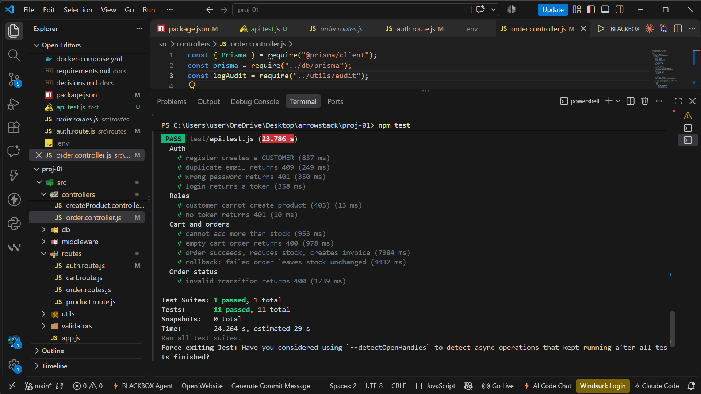

# b2b-order-management-plateform
B2B order management plateform: Node.js, Express.js, PostgreSQL (Prisma), JWT role-based auth. Arrowstack Full Stack internship, Project 1.

## Features

- Register / Login (JWT), roles: `CUSTOMER` and `ADMIN`
- Products CRUD (only admins can write)
- Cart API (add, view, update, remove)
- Orders: transactional, stock updates safe from race conditions, invoices
- Order status workflow (PENDING → PAID → SHIPPED → DELIVERED, or CANCELLED)
- Audit logs (who did what)
- Zod validation, global error handler, login rate limit

## Tech Stack

Node.js, Express, Prisma ORM, PostgreSQL (Neon), JWT, bcrypt, Zod, express-rate-limit

## Setup

```bash
git clone <repo-url>
cd proj-01
npm install
cp  .env    
npx prisma migrate dev
npm run dev
```

The server runs at `http://localhost:5000`.

## Environment Variables

```
DATABASE_URL=
JWT_SECRET=
PORT=5000
```

## API Endpoints

| Method | URL | Access |
|---|---|---|
| POST | /api/auth/register | Public |
| POST | /api/auth/login | Public (rate limited) |
| GET | /api/products | Public |
| GET | /api/products/:id | Public |
| POST / PUT / DELETE | /api/products | Admin |
| POST | /api/cart | Customer |
| GET | /api/cart | Customer |
| PUT / DELETE | /api/cart/:productId | Customer |
| POST | /api/orders | Customer |
| GET | /api/orders | Customer (own orders) |
| GET | /api/orders/all | Admin |
| PATCH | /api/orders/:id/status | Admin |
| GET | /api/orders/audit-logs | Admin |

Protected routes require the header: `Authorization: Bearer <token>`

## Order Flow

1. Read the cart; if it is empty, return `400`
2. Decrease each item's stock using a guarded query
3. Calculate the total (Decimal)
4. Create the Order and OrderItems (the price at that moment is copied)
5. Create the invoice (`INV-000001`)
6. Clear the cart

All of this happens inside a single `$transaction`.



## Protection Against Race Conditions

If two customers buy the last piece at the same time and the code first reads the stock and then subtracts, the stock can become `-1`. To avoid this, the check and the decrement happen in **a single query**:

```js
const result = await tx.product.updateMany({
  where: { id: productId, stock: { gte: quantity } },
  data: { stock: { decrement: quantity } },
});
// result.count === 0 means there was not enough stock
```

The database processes one query at a time on a given row, so the second customer's query never passes the condition.

## Proof of Transaction Rollback

Test: the cart had 2 products (first with quantity 2, second with quantity 5). The admin set the second product's stock to `1`, then the order was placed.
**Before** (stock of both products):



**Order response** (`400 Insufficient stock`):



**After**: the first product's stock is unchanged and no new Order was created:



This shows that the first product's decrement had already happened, but it was reverted when the transaction failed.
## Audit Logs

Order placement, status changes, and product create/update/delete actions are recorded in the `AuditLog` table. Order-related logs are written inside the transaction, so they are also rolled back if it fails.

## Tests

Automated tests (Jest + Supertest) cover auth, roles, cart, order placement, rollback and status transitions.

```bash
npm test
```



## Security Notes

- Passwords are hashed with bcrypt
- Registration never grants a role; users are always `CUSTOMER`
- Login returns the same error for a wrong email and a wrong password
- Login is rate limited (10 attempts per 15 minutes)
- `.env` is never pushed to git

## Known Limitations and Next Steps

- No payment integration
- No pagination or search on products yet
- Tokens are not revocable (no refresh tokens)
- Rate limiting is in-memory (use Redis for multiple servers)
- Possible improvements: frontend, email invoices, caching
